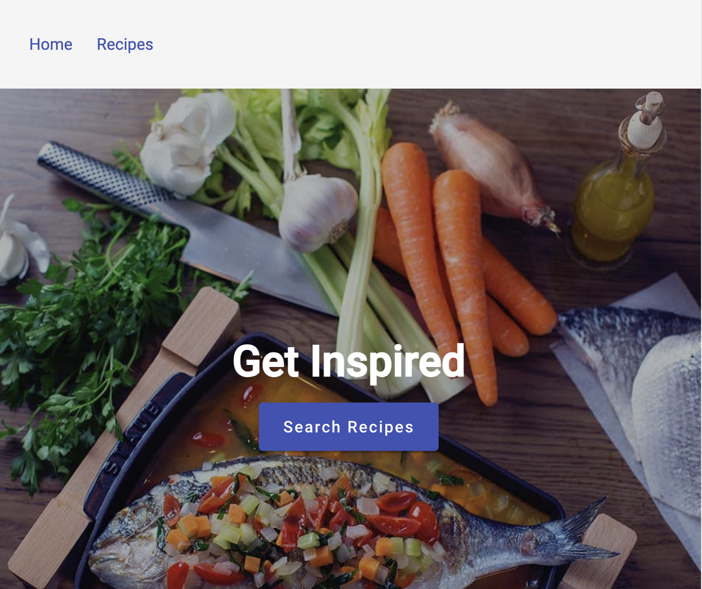

# Recipes App

An angular application that displays recipes from this
[API](https://recipesapi.kutaybekleric.com/recipes/)
, allows filtering, and provides more details about a specific recipe.

## Demo

<p align="center">
  
</p>

<br/>

Live Demo 👉🏼 : https://dorsaffrigui.github.io/recipes-app

## 🚀 Quick Start

Install dependencies :
```
npm install
```

Start the angular app and the server

```
npm run start      # Build the client and then starts the server in watch mode
```
<br>

Go to http://localhost:4200 and enjoy the demo application 😊

## Running unit tests

To execute the unit tests via [Karma](https://karma-runner.github.io)

```
npm run test     
```

